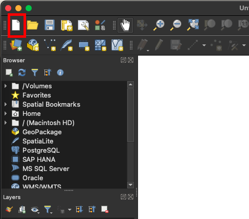
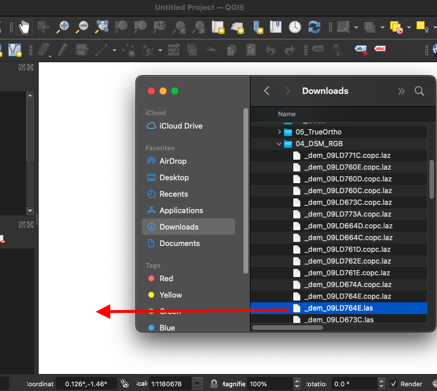
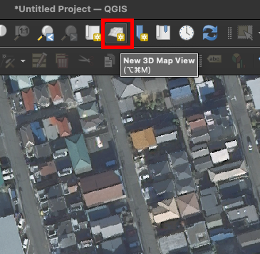
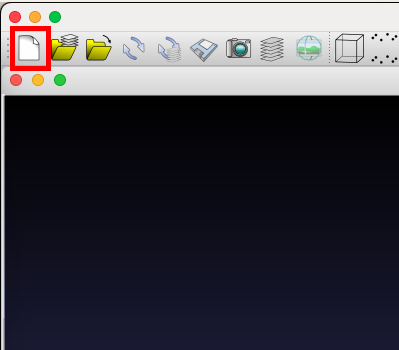
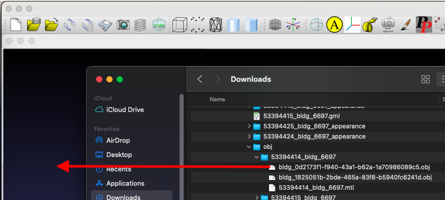
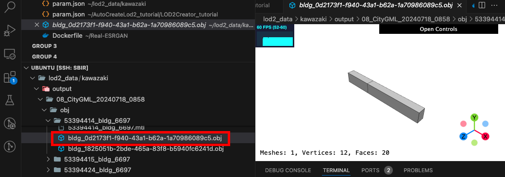

# 開発ツールの利用ガイド

## お知らせ
- 必ずこのツールを使う必要はありません
- 開発環境（OSなど）によって使用する違う場合もあります
- 便利そうなツールがありましたら、ここに使い方などを追加をお願いします


## QGIS
| 説明 | DSM ファイルの 点群を見る。 |
|-|-|
| 用途 | 特定の建物の形状を確認する。 |
| | ２重屋根の建物の座標を探す。 |
| 実行可能環境 | Windows / MacOS / Linux / BSD / Android / iOS / Wintab |
| ダウンロード | https://www.qgis.org/download/ |

- 新しいプロジェクトを作る
  - 
- DSM ファイル(las)をドラッグしてインポート
  - 
- 3D 形状の確認
  - 


## MeshLab
| 説明 | テクスチャーのある obj を確認。 |
|-|-|
| 用途 | 正確な obj 形状を確認。 |
| | ２重屋根の建物の座標を探す。 |
| 特徴（＋）| テクスチャを含めて、正確な obj 形状の確認ができる。 |
| 特徴（ー）| あまりたくさんの obj を同時に見せようとするとエラー。|
| 実行可能環境 | Windows / MacOS / Linux |
| ダウンロード | https://www.meshlab.net/#download |

- 新しいプロジェクトを作る
  - 
- 3D モデルファイル(obj)をドラッグしてインポート
  - 


## VSCode の mesh-viewer
| 説明 | テクスチャーのなし obj を確認。 |
|-|-|
| 用途 | リモート環境の ubuntu でテクスチャーのなしの obj を確認。 |
| | ２重屋根の建物の座標を探す。 |
| 特徴（＋）| リモート環境で生成した obj ファイルをいちいちダウンロードしないですぐに確認できる。|
| 特徴（ー）| 実際と少し違う形状に見せる場合がある。 |
| | テクスチャがまでは見られない |

- 3D モデルファイル(obj)をクリック
  - 


## 座標変換 : 平面直角座標(DSM 座標) <-> 緯度経度座標(CityGML 座標) 
| 実行ファイル位置 | `./debuggers/coord.py` |
|-|-|
| 説明 | 平面直角座標と緯度経度座標を変換 |
| 用途 | 座標を変換して使いたい場合、簡単に確認 |

```
# 6668(緯度経度座標)から、6669~6687(平面直角座標)へ
python ./debuggers/coord.py 6668 6677 35.91760209932579 139.27930937708183

# 6669~6687(平面直角座標)から、6668(緯度経度座標)へ
python ./debuggers/coord.py 6677 6668 -9000 -50000
```

## CityGMLファイル検索
| 実行ファイル位置 | `./debuggers/search_city_gml_file_by_pos.py` |
|-|-|
| 説明 | 領域内（平面直角座標・緯度経度座標）の入っている CityGML ファイルを探す |
| 用途 | 領域内（平面直角座標・緯度経度座標）の入っている CityGML ファイルを探す |

```
# 座標範囲 : -9000, -51000 〜 -10000, -52000
# CityGMLフォルダー : ~/lod2_data/kawazaki/08_CityGML
# 座標系番号 : 6677

python3 ./debuggers/search_city_gml_file_by_pos.py -9000 -51000 -10000 -52000 \
  ~/lod2_data/kawazaki/08_CityGML 6677
```

## DSMファイル検索(CityGMLファイル)
| 実行ファイル位置 | `./debuggers/search_dsm_file_by_city_gml.py` |
|-|-|
| 説明 | CityGML の座標範囲で DSM ファイルを探す |
| 用途 | 建築物LOD2自動生成ツールのデーター集めで、CityGML ファイルに必要な DSM ファイルだけを探す |

```
# CityGMLファイル ~/lod2_data/kawazaki/08_CityGML/53392535_bldg_6697_op.gml
# DSM フォルダー /lod2_data/kawazaki/04_DSM_RGB
# DSM ファイルの座標系番号 6677

python ./debuggers/search_dsm_file_by_city_gml.py \
  ~/lod2_data/kawazaki/08_CityGML/53392535_bldg_6697_op.gml \
  /lod2_data/kawazaki/04_DSM_RGB 6677
```

## DSMファイルが検索(平面直角座標)
| 実行ファイル位置 | `./debuggers/search_dsm_file_by_pos.py` |
|-|-|
| 説明 | 領域内（平面直角座標）に入っている DSM ファイルを探す |
| 用途 | ある座標の建物のを確認する場合、どの DSM ファイルを開いたらいいかのかわかる |

```
# 座標範囲 : -21146, -34454 〜 -21132, -34440
# DSM フォルダー : ~/DSM/DSM/

python3 ./debuggers/search_dsm_file_by_pos.py -21146 -34454 -21132 -34440 ~/DSM/DSM/
```

## DSM画像保存
| 実行ファイル位置 | `./debuggers/save_dsm_area_as_png.py` |
|-|-|
| 説明 | 平面直角座標の座標範囲ないに入っている DSM の画像を保存する |
| 用途 | 平面直角座標の領域内の建物を肉眼で確認したい場合 |

```
# 座標範囲 : -21146, -34454 〜 -21132, -34440
# DSMフォルダーパス : ~/DSM/DSM/

python3 ./debuggers/save_dsm_area_as_png.py -21146 -34454 -21132 -34440 ~/DSM/DSM/
```

## DSM壁線確認
| 実行ファイル位置 | `./debuggers/show_wall_point_as_png.py` |
|-|-|
| 説明 | 領域内（平面直角座標）に入っている DSM ファイルの RGB 画像に壁線を上書きした画像を出力 |
| 用途 | 建物の z座標が陥没している様子を見て、DSM ファイルのの品質を確認する |

```
# 座標範囲 : -21330, -34630 〜 -21030, -34330
# DSM フォルダー : ~/DSM/DSM/
# イメージ生成パス : ~/DSM/DSM/
# DSM点群xy間隔
# 壁認識基準(m) : 0.2

python3 ./debuggers/show_wall_point_as_png.py -21330 -34630 -21030 -34330 \
  ~/DSM/DSM/ -o ~/DSM/DSM/ -g 0.25 -w 0.2
```

## HEAT屋根線テスト
| 実行ファイル位置 | `/test_roof_edge.py` |
|-|-|
| 説明 | HEAT屋根線の問題を確認するためのプロトタイプ |
| 用途 | HEAT屋根線の問題を確認する |
| | HEAT屋根線の限界を説明するための資料を作る |

```
# 建築物イメージファイル : ~/bldg-lod2-tool/tools/Real-ESRGAN/output/DSM_-214_-347_out.jpg
# 屋根線を書いたイメージを出力するパス : .

python3 ./test_roof_edge.py ~/bldg-lod2-tool/tools/Real-ESRGAN/output/DSM_-214_-347_out.jpg -o .
```

## 3D形状生成テスト
| 実行ファイル位置 | `/test_roof_for_house_model.py` |
|-|-|
| 説明 | 3D形状生成の仕組みを理解する |
| 用途 | 3D形状生成のチュートリアル |

```
python3 ./test_roof_for_house_model.py
```
