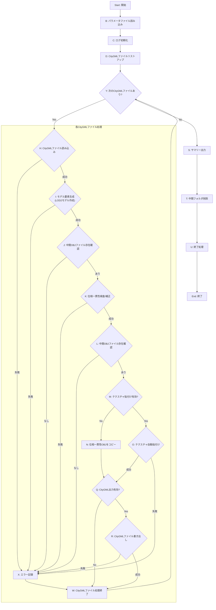
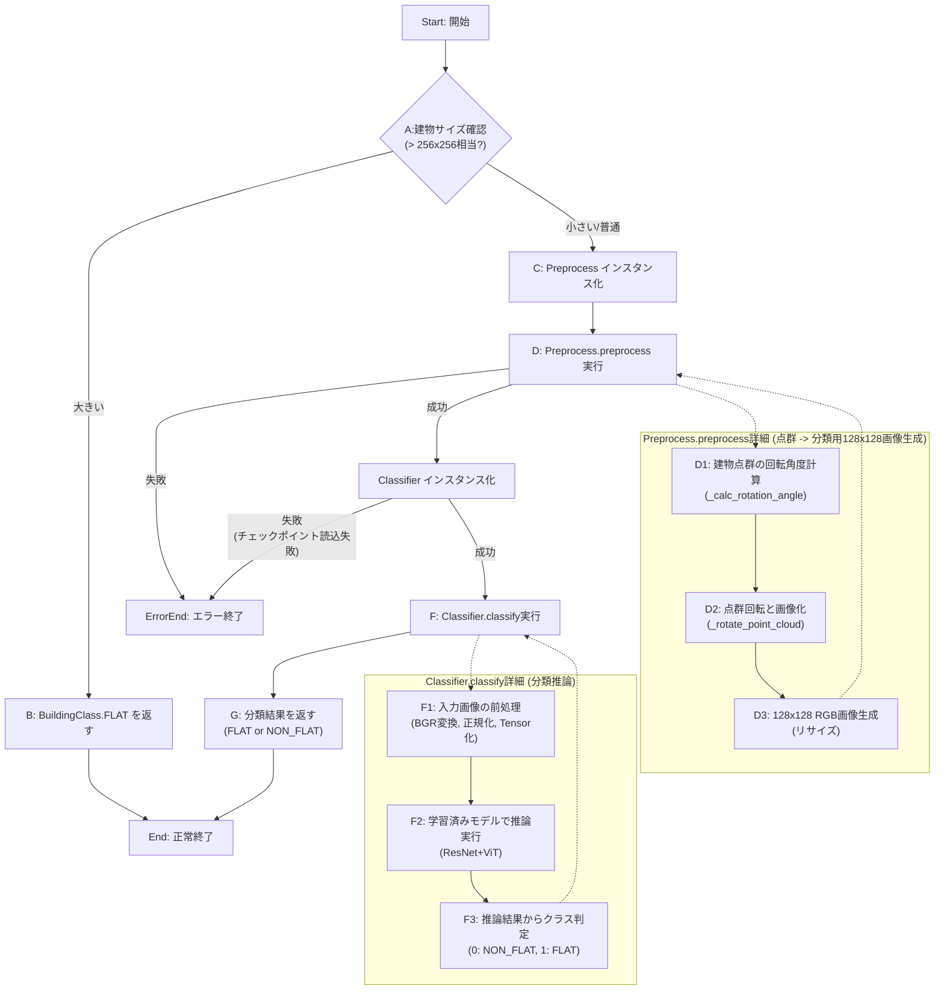
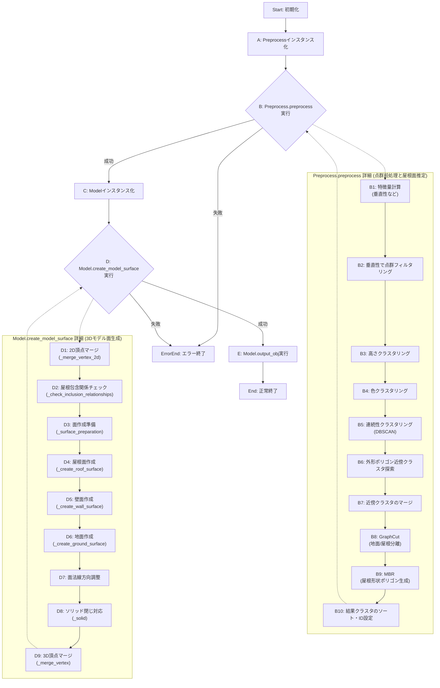
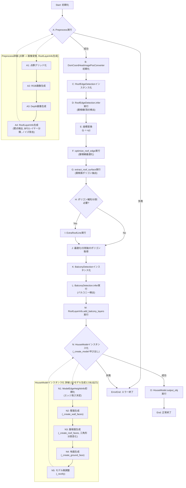
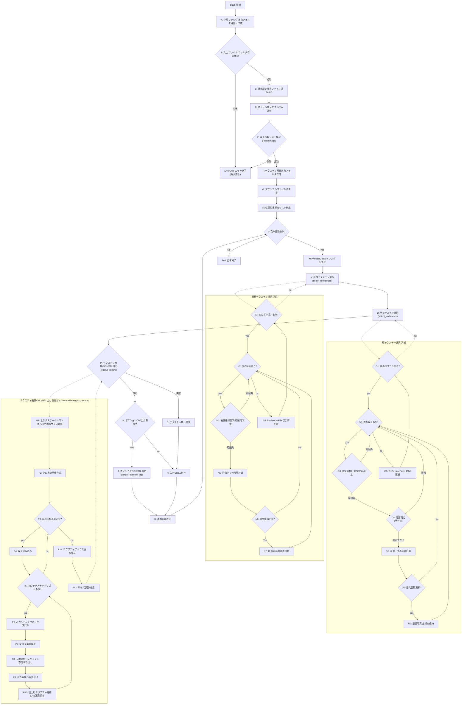

<!-- Google AI Studioにsrc以下を読み込ませて原案作成 -->

## AutoCreateLod2.py コマンドラインツールの処理フロー解説

提供されたPythonソースコード群は、CityGML形式のLOD1建物モデルデータと、関連する点群データ（LAS形式）、テクスチャ画像、カメラ情報などを入力とし、自動的にLOD2モデル（テクスチャ付き）を生成するコマンドラインツール `AutoCreateLod2.py` を構成します。

以下に、その処理の流れをフロー図とテキストで詳細に解説します。

### 全体処理フロー図

### 各ステップの詳細解説

1. **開始 (`A`)**:
    * コマンドラインから `AutoCreateLod2.py` が実行されます。
    * 引数としてパラメータファイル（JSON形式）のパスが渡されます。

2. **パラメータファイル読み込み (`B`)**:
    * `util/parammanager.py` の `ParamManager` クラスが、指定されたJSONファイルを読み込みます。
    * LASファイルの座標系、各種入力/出力フォルダパス、デバッグフラグ、位相一貫性チェックの閾値、テクスチャ出力設定などのパラメータが設定されます。
    * 必須パラメータの欠落や不正な値がないかチェックされ、問題があればエラー終了します。デフォルト値が採用された場合はログに出力されます。

3. **ログ初期化 (`C`)**:
    * `util/log.py` の `Log` クラスが初期化されます。
    * パラメータで指定されたログ出力フォルダ内に、実行日時を含むサブフォルダが作成されます。
    * メインの実行ログファイル (`main_log.txt`) と、標準出力用のロガーが設定され、ヘッダ情報（バージョン、開始日時、パラメータなど）が出力されます。

4. **CityGMLファイルリストアップ (`D`)**:
    * パラメータで指定されたCityGML入力フォルダ (`CityGMLFolderPath`) 内の `.gml` ファイルを `glob` を使って検索し、リスト化します。

5. **次のCityGMLファイルあり? (`Y`)**:
   * リストアップされたすべてのGMLファイルの処理が完了したか確認します。
   * まだ処理すべきファイルが残っていればループの先頭 (`H`) に戻ります。
       * 現在処理中のファイル名をメインログと標準出力に出力します (`Log.process_start_log`)。
       * 各モジュール（CityGML入力、モデル要素生成など）のログファイルの初期化と開始ログの書き込みを行います (`Log.module_start_log`)。

6. **CityGMLファイル読み込み (`H`)**:
    * `util/citygmlinfo.py` の `CityGmlManager` クラスが、対象の `.gml` ファイルを読み込みます。
    * 内部では `thirdparty/plateaupy` ライブラリ（特に `plbldg.py`）が使用され、GMLファイルをパースします。
    * 各建物のID (`build_id`) とLOD0の形状座標 (`lod0_poslist`) などを抽出し、`BuildInfo` オブジェクトのリストとして保持します。
    * パラメータで指定された場合、特定の建物IDや座標範囲で対象建物をフィルタリングします。
    * デバッグモードが有効な場合、パース結果を `.pkl` ファイルとしてキャッシュし、次回以降の読み込みを高速化します。
    * 読み込みに失敗した建物がある場合や、ファイルが存在しない場合はエラーまたは警告を記録します。読み込める建物が全くない場合はエラーとして処理を中断（`X`へ）します。

7. **モデル要素生成 (LOD2モデル作成) (`I`)**:
    * `createmodel/modelcreator.py` の `ModelCreator` クラスが、`CityGmlManager` から受け取った `BuildInfo` リストを元にLOD2モデルを生成します。
    * **内部処理の概要:**
        * 各 `BuildInfo` に対して `createmodel/building.py` の `Building` クラスのインスタンスを作成します。
        * `createmodel/lasmanager.py` の `LasManager` を使用して、パラメータで指定されたDSMフォルダ (`DsmFolderPath`) から関連するLASファイルを読み込み、建物の範囲内の点群データを抽出します。座標変換 (`DsmCoordCityGmlCoordConverter`) もここで行われます。
        * **建物分類:** `createmodel/buildingclassification/classifybuilding.py` が呼び出され、点群データから画像を生成し (`Preprocess`)、学習済みモデル (`Classifier`) を用いて建物が **陸屋根 (FLAT)** か **非陸屋根 (NON_FLAT)** かを分類します。デバッグモードでは分類結果もキャッシュされます。
        * **モデル生成:**
            * **陸屋根の場合:** `createmodel/buildingmodeling/createmodel.py` の `BuildingModelBuilder` が呼ばれます。
                * `Preprocess`: 点群をクラスタリング（高さ、色、連続性）し、主要な平面候補を抽出します。
                * `GraphCut`: 地面点と屋根点を分離します。
                * `MBR` (Minimum Bounding Rectangle): 推定された屋根平面を矩形近似し、屋根形状ポリゴンを生成します。
                * `Model`: 屋根面、壁面、地面の3Dメッシュを生成します。
            * **非陸屋根の場合:** `createmodel/housemodeling/createmodel.py` の `HouseModelBuilder` が呼ばれます。
                * `Preprocess`: 点群からモデル入力用のRGB画像とDepth画像を生成します。
                * `RoofLayerInfo`: 点群を高さで階層化（レイヤー化）します。
                * `RoofEdgeDetection`: 学習済みモデル (HEAT: `thirdparty/heat`) を使用して、生成画像から屋根の頂点とエッジ（屋根線）を検出します。
                * `BalconyDetection`: 学習済みモデル (`balcony_segmentation_model`) を使用して、バルコニー領域をセグメンテーションします。
                * `optimize_roof_edge`: 検出された屋根線を最適化（外形線へのスナップ、直線化、交点生成など）します。
                * `extract_roof_surface`: 最適化された屋根線から屋根面ポリゴンを抽出します。
                * `ExtraRoofLine`: 不完全な屋根ポリゴンを検出し、必要に応じて分割・補完します。
                * `ModelEdgeHeightInfo`: 屋根のエッジ（壁の上辺・下辺）の高さを決定します。
                * `HouseModel`: 屋根面、壁面、地面の3Dメッシュを生成します。
    * 生成された各建物の3Dモデルは、中間フォルダ (`Config.OUTPUT_MODEL_OBJDIR`) に `.obj` ファイルとして出力されます。
    * モデル生成に失敗した建物がある場合はエラーまたは警告を記録します。

8. **中間OBJファイル存在確認 (`J`)**:
   * モデル要素生成ステップで `.obj` ファイルが正しく出力されたか確認します。
   * ファイルが存在しない場合はエラーログを出力し、次のファイル処理へスキップします (`X`へ)。

9. **位相一貫性検査/補正 (`K`)**:
   * `phaseconsistensy/mainmanager.py` の `MainManager` クラスが、生成されたOBJファイルに対して位相一貫性の検査と自動補正を行います。
   * **内部処理:**
       * 各OBJファイルを `trimesh` および `util/objinfo.py` の `ObjInfo` を使って読み込みます。
       * `phaseconsistensy/checkface.py` の `CheckFace` および `CheckFaces` クラスを用いて以下の検査・補正を実行します。
           * **連続頂点重複:** 同じ座標の頂点が連続している場合、1つにマージします。
           * **ソリッド閉合:** モデルが閉じていない（穴が開いている）場合、エラーとします（`trimesh.is_watertight`）。補正は行いません。
           * **非平面:** 4頂点以上で構成されるポリゴンが同一平面上にない場合、`earcut` ( `thirdparty/plateaupy/thirdparty/earcutpython` ) を利用して三角形に分割し補正します。
           * **面積0ポリゴン:** 面積を持たないポリゴン（線分や点に縮退している）を削除します。
           * **自己交差・自己接触:** ポリゴン自身のエッジが交差または接触している場合、エラーとします。補正は行いません。
           * **地物内面同士交差:** 異なるポリゴン同士が交差している場合、エラーとします。補正は行いません。
       * 検査結果は `phaseconsistensy/resultinfo.py` の `ResultInfo` に記録されます。
       * 自動補正が行われた場合、または補正不可能なエラーが検出された場合は警告ログが出力されます。
       * パラメータ `DeleteErrorObject` がTrueの場合、補正不可能なエラーを持つOBJファイルは削除されます。
   * 処理後の（またはエラーにより未処理/削除された）OBJファイルは、別の中間フォルダ (`Config.OUTPUT_PHASE_OBJDIR`) に出力されます。

10. **中間OBJファイル存在確認 (`L`)**:
    * 位相一貫性検査/補正ステップで `.obj` ファイルが正しく出力されたか（またはエラーで削除されなかったか）を確認します。
    * ファイルが存在しない場合はエラーログを出力し、次のファイル処理へスキップします (`X`へ)。

11. **テクスチャ貼付け有効? (`M`)**:
    * パラメータ `OutputTexture` がTrueかどうかを判定します。

12. **位相一貫性OBJをコピー (`N`)**:
    * テクスチャ貼付けが無効の場合、位相一貫性チェック後の中間フォルダ (`Config.OUTPUT_PHASE_OBJDIR`) の内容を、テクスチャ貼付け後の中間フォルダ (`Config.OUTPUT_TEX_OBJDIR`) にコピーします。
    * パラメータ `OutputOBJ` がTrueの場合、最終出力用のOBJフォルダにもコピーします。

13. **テクスチャ自動貼付け (`O`)**:
    * `texturemapping/texturemain.py` の `TextureMain` クラスが、位相一貫性チェック済みのOBJファイルにテクスチャを貼り付けます。
    * **内部処理:**
        * パラメータで指定された外部標定要素ファイル (`ExternalCalibElementPath`) とカメラ情報ファイル (`CameraInfoPath`) を読み込みます。
        * パラメータで指定されたテクスチャフォルダ (`TextureFolderPath`) 内の画像ファイルを `PhotoImage` として読み込み、リスト化します。
        * 各建物のOBJファイルを `VerticalObject` として読み込みます。
        * 各ポリゴン（屋根、壁）に対して、最も適切に投影される写真 (`PhotoImage`) を選択します (`select_rooftexture`, `select_walltexture`)。
            * 写真内のポリゴンの面積や陰面判定などを考慮します。
        * 選択されたテクスチャ画像を1枚のアトラス画像にまとめ、指定された形式（例: PNG）で出力フォルダ (`OutputFolderPath` 内の `_appearance` フォルダ）に保存します (`DstTextureFile.output_texture`)。
        * OBJファイルのテクスチャ座標 (vt) を更新し、マテリアルファイル (`.mtl`) を生成して、中間フォルダ (`Config.OUTPUT_TEX_OBJDIR`) に出力します。
        * パラメータ `OutputOBJ` がTrueの場合、最終出力用のOBJ/MTLファイルも生成します。
    * 適切なテクスチャが見つからない場合などは警告ログが出力されます。

14. **CityGML出力有効? (`Q`)**:
    * パラメータ `OutputCityGML` がTrueかどうかを判定します。

15. **CityGMLファイル書き出し (`R`)**:
    * `util/citygmlinfo.py` の `CityGmlManager` クラスが、最終的なLOD2モデル情報を持つCityGMLファイルを出力します。
    * **内部処理:**
        * テクスチャ貼付け後の中間フォルダ (`Config.OUTPUT_TEX_OBJDIR`) からOBJ/MTLファイルを読み込み、頂点座標、テクスチャ座標、テクスチャファイルURIなどの情報を `BuildInfo` に反映させます (`_copy_objdata`)。
        * 元のLOD1 CityGMLファイルを `lxml` で読み込みます。
        * 各建物要素 (`bldg:Building`) に対して以下の要素を追加・更新します。
            * `bldg:lod2Solid`: LOD2のソリッド形状（各面の参照）。
            * `bldg:boundedBy`: 各面の詳細形状（`bldg:RoofSurface`, `bldg:WallSurface`, `bldg:GroundSurface` 内の `gml:Polygon`）。
            * `app:appearanceMember`: テクスチャ情報（画像URI、MIMEタイプ、テクスチャ座標）。
        * 更新されたCityGMLツリーを指定された出力フォルダ (`OutputFolderPath`) に書き出します。
    * LoD1のテクスチャデータ (`_appearance` フォルダ）が存在する場合、それも出力フォルダにコピーします。

16. **CityGMLファイル処理結果 / エラー記録 (`W`, `X`)**:
    * 各モジュールの処理結果（成功、警告、エラー）をログに出力します (`Log.module_result_log`)。
    * エラーが発生した場合も、エラー内容をログに記録し、次のファイルの処理に進みます。

17. **サマリー出力 (`S`)**:
    * すべてのGMLファイルの処理が完了した後、各建物の処理結果（CityGML読み込み成功/失敗、LOD2モデル作成成功/失敗、各検査結果など）をまとめたCSVファイル (`model_create_result.csv`) をログフォルダに出力します (`Log.output_summary`)。

18. **中間フォルダ削除 (`T`)**:
    * 処理中に作成された一時フォルダ (`Config.OUTPUT_OBJDIR` およびそのサブフォルダ）を削除します。

19. **終了処理 (`U`)**:
    * メインログファイルと標準出力に終了日時と総処理時間を出力します (`Log.log_footer`)。

20. **終了 (`End`)**:
    * プログラムを終了します。

### 主要な使用ライブラリと役割

* **plateaupy (thirdparty):** CityGMLファイルのパース。`plbldg` で建物情報、`plobj` で基本オブジェクト、`earcut` でポリゴンの三角形分割。
* **numpy:** 数値計算、配列操作。点群データや座標の扱いに多用。
* **shapely:** ジオメトリ演算。ポリゴンの包含関係、距離計算、和差演算など。
* **trimesh:** 3Dメッシュ処理。OBJファイルの読み込み、`is_watertight` でソリッド閉合チェック。
* **OpenCV (cv2):** 画像処理。テクスチャ画像の読み込み、リサイズ、合成など。`Cv2Japanese` で日本語パス対応。
* **scikit-learn (sklearn):** 機械学習ライブラリ。`NearestNeighbors` で近傍探索、`DBSCAN`, `MeanShift` でクラスタリング。
* **PyTorch (torch):** ディープラーニングフレームワーク。建物分類、屋根線検出、バルコニーセグメンテーションのモデルで使用。
* **Open3D (o3d):** (DebugUtil内) デバッグ用の3D点群・メッシュ表示。
* **Matplotlib:** (DebugUtil内) デバッグ用のグラフ・ジオメトリ描画。
* **lxml:** XML/GMLファイルのパースと書き出し。CityGMLの読み書きに使用。
* **anytree:** (MBR内) 木構造データ。MBRの階層構造管理に使用。
* **maxflow:** (GraphCut内) グラフカットアルゴリズム。点群のセグメンテーションに使用。
* **alphashape:** 点群からアルファシェイプ（輪郭）を生成。
* **jakeristics:** 点群の特徴量計算。
* **ml_collections:** Google製の高機能辞書型。設定管理に使用。
* **einops:** テンソル操作ライブラリ。Transformerモデル内で使用。
* **HEAT (thirdparty):** 屋根線検出モデル。
* **Deformable Transformer (thirdparty/heat/models):** Transformerの一種。HEATモデル内で使用。

## `createmodel/buildingclassification/classifybuilding.py` の `classify_building` 関数の処理

### `classify_building` 処理フロー図 (Mermaid)

### 各ステップの詳細解説

1.  **`classify_building` 開始 (`Start`)**:
    *   呼び出し元から、建物の点群データ (`cloud`)、外形ポリゴン (`shape`)、建物ID (`building_id`)、学習済みモデルのパス (`classifier_checkpoint_path`) などを受け取ります。

2.  **建物サイズ確認 (`A`)**:
    *   **目的:** 処理負荷が高い、または複雑な屋根形状を持つ可能性が低い非常に大きな建物を早期に判定し、処理をスキップするため。
    *   **処理:** 入力点群のXYバウンディングボックスから、指定されたグリッドサイズ (`grid_size`) と拡大率 (`expand_rate_for_house_model`) を基に、モデル入力時の推定画像サイズを計算します。
    *   **判定:** 推定画像サイズの幅または高さが **256** ピクセルを超える場合、「大きい」と判定します。

3.  **`BuildingClass.FLAT` を返す (`B`)**:
    *   建物が「大きい」と判定された場合、詳細な分類処理を行わず、強制的に陸屋根 (`BuildingClass.FLAT`) として結果を返し、処理を終了します。

4.  **`Preprocess` インスタンス化 (`C`)**:
    *   建物サイズが処理範囲内の場合、`createmodel/buildingclassification/preprocess.py` の `Preprocess` クラスをインスタンス化します。このクラスは点群データをモデル入力用の画像に変換します。

5.  **`Preprocess.preprocess` 実行 (`D`)**:
    *   `Preprocess` インスタンスの `preprocess` メソッドを実行します。
    *   **内部処理フロー (`D1` ~ `D3`)**:
        1.  **建物点群の回転角度計算 (`D1`)**: `_calc_rotation_angle` メソッドで、建物外形ポリゴンの最も長い辺の角度を計算し、建物の主方向を決定します。
        2.  **点群回転と画像化 (`D2`)**: `_rotate_point_cloud` メソッドで、点群データを建物の主方向が画像の水平または垂直になるように回転させます。その後、回転後の点群をグリッド化し、各グリッドに最近傍点のRGB値を割り当ててカラー画像を生成します。
        3.  **128x128 RGB画像生成 (`D3`)**: 生成されたカラー画像を、分類モデルの入力サイズである **128x128** ピクセルにリサイズします。
    *   **出力:** 128x128ピクセルのRGB画像 (`building_img`) が返されます。
    *   **エラー:** 内部処理で問題が発生した場合、例外が発生しエラー終了 (`ErrorEnd`) する可能性があります。

6.  **`Classifier` インスタンス化 (`E`)**:
    *   `createmodel/buildingclassification/classifier.py` の `Classifier` クラスをインスタンス化します。
    *   **内部処理:**
        *   `ClassifierModel` (ResNet + Vision Transformerベース) を定義します。
        *   GPUが利用可能かつ `use_gpu` フラグがTrueであればGPU、そうでなければCPUを推論デバイスとして設定します。
        *   `torch.load` を使用して、指定された `classifier_checkpoint_path` から学習済みモデルの重みをロードします。
    *   **エラー:** チェックポイントファイルのパスが不正、ファイル破損、モデル構造との不一致などによりロードに失敗した場合、`ClassifierCheckpointReadException` が発生し、エラー終了 (`ErrorEnd`) します。

7.  **`Classifier.classify` 実行 (`F`)**:
    *   `Classifier` インスタンスの `classify` メソッドを実行し、前処理で生成された画像 (`building_img`) を用いて分類推論を行います。
    *   **内部処理フロー (`F1` ~ `F3`)**:
        1.  **入力画像の前処理 (`F1`)**: 入力画像 (HWC, RGB, uint8) をモデルが受け付ける形式 (CHW, BGR, float32, 値域0.0-1.0) に変換し、PyTorch Tensorにします。
        2.  **学習済みモデルで推論実行 (`F2`)**: `ClassifierModel` にTensorを入力し、フォワードパスを実行します。モデルは2つのクラス（0: NON_FLAT, 1: FLAT）に対するロジット（確率に変換される前の値）を出力します。
        3.  **推論結果からクラス判定 (`F3`)**: 出力されたロジットのうち、値が大きい方のインデックスを取得します。インデックスが0なら非陸屋根 (`BuildingClass.NON_FLAT`)、1なら陸屋根 (`BuildingClass.FLAT`) と判定します。
    *   **出力:** 判定された `BuildingClass` (Enum値) が返されます。

8.  **分類結果を返す (`G`)**:
    *   `Classifier.classify` から返された建物の分類結果 (`BuildingClass.FLAT` または `BuildingClass.NON_FLAT`) を、`classify_building` 関数の最終的な戻り値として返します。

9.  **終了 (`End`, `ErrorEnd`)**:
    *   分類結果を返して正常終了 (`End`) するか、途中でエラーが発生した場合はエラー終了 (`ErrorEnd`) します。

### 関連クラスと役割（classify_building内および呼び出し先）

*   **`createmodel.buildingclassification.preprocess.Preprocess`**: 点群データをモデル入力に適した画像（128x128 RGB、回転補正済み）に変換する。
*   **`createmodel.buildingclassification.classifier.Classifier`**: 学習済みモデルをロードし、入力画像に対する分類推論を実行する。
*   **`createmodel.buildingclassification.classifier_model.ClassifierModel`**: 建物分類を行うための深層学習モデル（ResNet+ViT）のアーキテクチャを定義する。
*   **`createmodel.lasmanager.PointCloud`**: 建物点群データを保持・管理する。
*   **`shapely.geometry.Polygon`**: 建物外形形状を表現し、辺の長さなどを計算するために使用される。
*   **`cv2` (OpenCV)**: 画像のリサイズや回転などの前処理に使用される。
*   **`numpy`**: 配列操作、数値計算に使用される。
*   **`torch` (PyTorch)**: 深層学習モデルの定義、重みロード、推論実行に使用される。
*   **`createmodel.buildingclassification.classifier.BuildingClass` (Enum)**: 分類結果（FLAT, NON_FLAT）を表現する列挙型。

## `createmodel/buildingmodeling/createmodel.py`内の`BuildingModelBuilder`クラス（陸屋根モデル用）の処理

`BuildingModelBuilder` は、入力された点群データと建物外形ポリゴンから、陸屋根の3Dモデル（OBJ形式）を生成する役割を担います。

### `BuildingModelBuilder` 処理フロー図

### 各ステップの詳細解説

1.  **初期化 (`Start`)**:
    * 呼び出し元 ( `createmodel/building.py` の `Building.create` ) から以下の情報を受け取ります。
        * `cloud`: `PointCloud` オブジェクト（建物全体の点群データ）。
        * `shape`: `shapely.geometry.Polygon` オブジェクト（建物外形ポリゴン）。
        * `graphcut_height`: GraphCut処理で使用する地面の推定高さ。
        * `grid_size`: 点群データの解像度（メートル）。
        * `building_id`: 建物のID。
        * `min_ground_height`: 最低地面高さ。
        * `output_folder_path`: 生成されるOBJファイルの出力先フォルダパス。

2.  **`Preprocess` インスタンス化 (`A`)**:
    * `createmodel/buildingmodeling/preprocess.py` の `Preprocess` クラスのインスタンスを作成します。このクラスは、点群データを処理して屋根面候補を抽出・整形する役割を持ちます。

3.  **`Preprocess.preprocess` 実行 (`B`)**:
    * `Preprocess` インスタンスの `preprocess` メソッドを実行し、屋根面候補となるクラスタ情報を取得します。
    * **内部処理フロー (`B1`〜`B10`)**:
        1.  **特徴量計算 (`B1`)**: `jakeristics.compute_features` を使用して、点群の各点における特徴量（平面性、直線性、**垂直性**など）を計算します。探索半径は `param.verticality_search_radius` で指定されます。
        2.  **垂直性で点群フィルタリング (`B2`)**: 計算された垂直性 (`verticality`) が閾値 (`param.verticality_th`) 未満の点（水平に近い面を構成する点）を抽出します。これにより、壁などの垂直面を除外します。
        3.  **高さクラスタリング (`B3`)**: フィルタリングされた点群を高さ（Z座標）に基づいてクラスタリングします (`MeanShift` アルゴリズムを使用)。`param.height_band_width` が高さのバンド幅（同じクラスタと見なす高さの範囲）を指定します。これにより、異なる高さの屋根や構造物を分離します。
        4.  **色クラスタリング (`B4`)**: 高さでクラスタリングされた各グループ内で、さらに色情報 (RGB) に基づいてクラスタリングします (`MeanShift` を使用)。`param.color_band_width` が色のバンド幅を指定します。材質の異なる屋根面などを分離する目的です。
        5.  **連続性クラスタリング (DBSCAN) (`B5`)**: 色でクラスタリングされた各グループ内で、空間的な近接性に基づいてさらにクラスタリングします (`DBSCAN` アルゴリズムを使用)。`param.dbscan_search_radius` (探索半径) と `param.dbscan_point_th` (コア点閾値) でパラメータを指定します。点数が `param.dbscan_cluster_point_th` 未満の小さなクラスタはノイズとして除去されます。
        6.  **外形ポリゴン近傍クラスタ探索 (`B6`)**: 建物外形ポリゴン (`shape`) の辺上を `param.search_near_polygon_sample_step` 間隔でサンプリングし、各サンプリング点から `param.search_near_polygon_search_radius` 半径内にあるクラスタを「外形近傍クラスタ」としてマークします (`NearestNeighbors` を使用)。
        7.  **近傍クラスタのマージ (`B7`)**: 外形近傍クラスタ同士で、平均高さの差が `param.merge_height_diff_th` 未満であり、かつ空間的に連続している（`DBSCAN` で判定、パラメータは `param.merge_dbscan_radius`, `param.merge_dbscan_point_th`）ものを1つのクラスタにマージします。
        8.  **GraphCut (地面/屋根分離) (`B8`)**: `createmodel/buildingmodeling/graphcut.py` の `GraphCut` クラスを用いて、マージされたクラスタ群と、クラスタリングされなかった点群を対象に、地面と屋根をより正確に分離します。
            * 各クラスタが地面かどうかを判定します（`_check_ground_cluster`: 高さ、面積、形状、包含関係などを考慮）。
            * GraphCutアルゴリズム (`maxflow.fastmin.aexpansion_grid`) を適用し、各点を最も確からしい屋根面ラベルまたは無効ラベルに割り当てます。データ項（点と平面候補の距離）と平滑化項（隣接点とのラベル整合性、`param.graphcut_smooth_weight` で重み付け）を考慮します。
            * 同じ高さ（差が `param.graphcut_height_diff_th` 未満）で空間的に連続な（`DBSCAN` で判定）屋根ラベルの点群を再度マージします。
            * 最終的な屋根面クラスタ (`ClusterInfo` のリスト）を生成します。
        9.  **MBR (屋根形状ポリゴン生成) (`B9`)**: `createmodel/buildingmodeling/mbr.py` の `MBR` クラスを用いて、GraphCutで得られた各屋根面クラスタの点群から、最小境界矩形（Minimum Bounding Rectangle）ベースの手法で屋根形状ポリゴン (`roof_line`) を生成・整形します。
            * 点群を主方向（建物の主要な壁の向き）に回転させ、MBRアルゴリズムを階層的に適用して矩形を抽出・合成します。
            * パラメータ（`param.mbr_***`）で矩形の面積、幅、細長度などでフィルタリングします。
            * 抽出されたポリゴンを `shapely` で整形（簡略化、ノイズ除去、マージなど）します。
        10. **結果クラスタのソート・ID設定 (`B10`)**: 生成された `ClusterInfo` リストを点数の降順でソートし、IDを再割り当てします。
    * `preprocess` メソッドは、整形された屋根面ポリゴンを持つ `ClusterInfo` のリストを返します。処理中にエラーが発生した場合は `ModelingException` が発生します。

4.  **`Model` インスタンス化 (`C`)**:
    * `createmodel/buildingmodeling/model.py` の `Model` クラスのインスタンスを作成します。建物ID、建物外形ポリゴン (`shape`)、階層分類フラグ (`use_hier_classify`) を渡します。

5.  **`Model.create_model_surface` 実行 (`D`)**:
    * `Model` インスタンスの `create_model_surface` メソッドを実行し、3Dモデルの面（屋根、壁、地面）を生成します。
    * **内部処理フロー (`D1` ~ `D9`)**:
        1.  **2D頂点マージ (`D1`)**: `_merge_vertex_2d` メソッドを呼び出し、`Preprocess` で生成された各屋根面ポリゴン (`ClusterInfo.roof_line`) の頂点のうち、近接（距離が `param.model_point_merge_xy_dist` 未満）するものを同じ座標にマージします。これにより、隣接する屋根面の境界頂点が一致するようにします。
        2.  **屋根包含関係チェック (`D2`)**: `_check_inclusion_relationships` メソッドを呼び出し、屋根面ポリゴン同士の包含関係（どちらが親でどちらが子か）を判定し、`ClusterInfo` の `parent`, `children` 属性を設定します。
        3.  **面作成準備 (`D3`)**: `_surface_preparation` メソッドを呼び出し、壁面や屋根面を生成するための前準備を行います。
            * 親屋根と子屋根でクラスタをグルーピングします (`_grouping_roof`)。
            * 建物外形 (`shape`) の最長辺を基準に、モデル全体の回転角度を計算します (`_calc_rotate_angle`)。
            * 各屋根ポリゴンの頂点を回転させ、辺の角度と距離に基づいてグルーピングします (`_rotate_edge`, `_angle_clustering`, `_edge_dist_clustering`)。
            * グループ化された辺情報を用いて、隣接する屋根間で頂点が欠落している箇所（本来接続されるべき箇所）を検出し、補完すべき頂点情報をリストアップします (`_search_for_missing_vertices`)。
            * 検出された不足頂点を各屋根ポリゴン (`ClusterInfo.roof_line`) に追加挿入します。
            * 再度2D頂点マージ (`_merge_vertex_2d`) を行い、追加した頂点を整理します。
            * 最終的な壁面生成に使用する輪郭線情報 (`_outlines`: 最外周と島状屋根の外周）を作成します。
        4.  **屋根面作成 (`D4`)**: `_create_roof_surface` メソッドを呼び出し、整形された屋根ポリゴン (`ClusterInfo.roof_line`) と推定された屋根高さ (`ClusterInfo.roof_height`) から、3Dの屋根面 (`FaceInfo`, `FaceType.ROOF`) を作成します。入れ子構造（`ClusterInfo.children`）がある場合は、`shapely` を用いて穴あきポリゴンを適切に分割し、複数の単純なポリゴン面として生成します。
        5.  **壁面作成 (`D5`)**: `_create_wall_surface` メソッドを呼び出し、屋根面間の境界線や建物外周線 (`_outlines`) から壁面 (`FaceInfo`, `FaceType.WALL`) を生成します。
            * `networkx` を用いて屋根と外周線の接続関係グラフを構築します。
            * 双方向エッジ（隣接する屋根境界または屋根と外周）を見つけ、`LineInfo` を作成します。
            * 各 `LineInfo` に対して、接続する2つの屋根（または屋根と地面）の高さを取得し、その間の垂直なポリゴン（壁面）を生成します。
            * 壁面の法線方向が建物の外側を向くように調整します (`_calc_wall_normal_vector`, `_check_reverse_wall`)。
        6.  **地面作成 (`D6`)**: `_create_ground_surface` メソッドを呼び出し、建物外形ポリゴン (`shape`) と指定された地面高さ (`ground_height`) から、地面 (`FaceInfo`, `FaceType.GROUND`) を作成します。法線方向が下向きになるように頂点順序を調整します。
        7.  **面法線方向調整 (`D7`)**: パラメータ `param.front_is_ccw` がFalseの場合、全ての面の頂点順序を反転させ、時計回りを表面（法線方向）とします。
        8.  **ソリッド閉じ対応 (`D8`)**: `_solid` メソッドを呼び出し、隣接する面の間で頂点が微妙にずれて隙間ができている箇所を検出（`_add_missing_vertex`）し、頂点を追加して隙間を埋め、モデルが水密（閉じた状態）になるように調整します。辺上の点かどうかの判定には距離閾値 `param.solid_search_edge_th` を使用します。
        9.  **3D頂点マージ (`D9`)**: `_merge_vertex` メソッドを呼び出し、最終的な3Dモデルの全頂点に対して、近接（XY距離が `param.model_point_merge_xy_dist` 未満、Z差が `param.model_point_merge_z_reso` 未満）する頂点を1つにマージします。これにより、不要な微小ポリゴンや重複頂点を削減します。連続する同一頂点も削除します。
    * `create_model_surface` メソッドは、生成された全ての面情報を `Model._faces` に格納します。

6.  **`Model.output_obj` 実行 (`E`)**:
    * `Model` インスタンスの `output_obj` メソッドを実行し、生成された面情報 (`Model._faces`) を元にOBJファイルを指定されたパス (`output_folder_path` 内の `{building_id}.obj`) に書き出します。
    * 屋根 (`# ROOF`)、壁 (`# WALL`)、地面 (`# GROUND`) のグループに分けて出力されます。

7.  **終了 (`End`, `ErrorEnd`)**:
    * 正常にOBJファイルが出力されれば `End` で終了します。
    * 途中で `ModelingException` が発生した場合や、予期せぬエラーが発生した場合は `ErrorEnd` となり、呼び出し元に例外が伝播されます。

### 主要な使用クラス・モジュール（BuildingModelBuilder内部）

* **`createmodel.buildingmodeling.preprocess.Preprocess`**: 点群の前処理、クラスタリング、屋根面候補の抽出・整形。
* **`createmodel.buildingmodeling.model.Model`**: 3Dモデル面の生成、管理、OBJ出力。
* **`createmodel.buildingmodeling.clusterinfo.ClusterInfo`**: 点群クラスタとその属性（屋根ポリゴン、高さ、親子関係など）を保持。
* **`createmodel.buildingmodeling.graphcut.GraphCut`**: GraphCutアルゴリズムによる地面/屋根分離。
* **`createmodel.buildingmodeling.mbr.MBR`**: 最小境界矩形ベースでの屋根形状ポリゴン生成。
* **`createmodel.buildingmodeling.planeinfo.PlaneInfo`**: 平面情報（パラメータ、法線ベクトル）の管理。
* **`createmodel.buildingmodeling.geoutil.GeoUtil`**: ジオメトリ関連のユーティリティ関数（正規化、角度計算、距離計算など）。
* **`createmodel.lasmanager.PointCloud`**: 点群データ（座標、色、インデックス）の管理。
* **`createmodel.param.ModelingParam`**: モデル生成パラメータの管理（シングルトン）。
* **`shapely`**: ジオメトリ演算。ポリゴンの作成、和差演算、包含判定、バッファ処理など。
* **`sklearn.cluster.MeanShift`, `DBSCAN`**: クラスタリングアルゴリズム。
* **`sklearn.neighbors.NearestNeighbors`, `KDTree`**: 近傍探索。
* **`jakeristics.compute_features`**: 点群の特徴量計算。
* **`maxflow.fastmin.aexpansion_grid`**: GraphCutアルゴリズムの実装。
* **`alphashape.alphashape`**: 点群からアルファシェイプを生成。
* **`networkx`**: グラフ理論ライブラリ。壁面生成時の接続関係解析に使用。
* **`anytree`**: 木構造データ。MBRの階層管理に使用。
* **`numpy`**: 数値計算、配列操作。

## `createmodel/housemodeling/createmodel.py`内の`HouseModelBuilder`クラス（非陸屋根、つまり切妻屋根や寄棟屋根などの一般的な家屋形状のモデル用）の処理

`HouseModelBuilder` は、`BuildingModelBuilder` と同様に入力データを受け取りますが、屋根形状が複雑であるため、機械学習モデルを用いた屋根線検出やバルコニー検出などの追加処理を行い、より詳細な3Dモデルを生成します。

### `HouseModelBuilder` 処理フロー図

### 各ステップの詳細解説

1.  **初期化 (`Start`)**:
    * 呼び出し元 ( `createmodel/building.py` の `Building.create` ) から以下の情報を受け取ります。
        * `cloud`: `PointCloud` オブジェクト（建物全体の点群データ）。
        * `shape`: `shapely.geometry.Polygon` オブジェクト（建物外形ポリゴン）。
        * `building_id`: 建物のID。
        * `min_ground_height`: 最低地面高さ。
        * `output_folder_path`: 生成されるOBJファイルの出力先フォルダパス。
        * `balcony_segmentation_checkpoint_path`: バルコニー検出用学習済みモデルのパス。
        * `roof_edge_detection_checkpoint_path`: 屋根線検出用学習済みモデルのパス。
        * `grid_size`: 点群データの解像度（メートル）。
        * `expand_rate`: モデル入力画像の拡大率。
        * `use_gpu`: GPUを使用するかどうかのフラグ。
        * `debug_mode`: デバッグモードフラグ。

2.  **`Preprocess` 実行 (`A`)**:
    * `createmodel/housemodeling/preprocess.py` の `Preprocess` クラスの `preprocess` メソッドを実行します。
    * **内部処理フロー (`A1` ~ `A4`)**:
        1.  **点群グリッド化 (`A1`)**: 入力点群 (`cloud`) を、指定された `grid_size` と `expand_rate` に基づいて `image_size` x `image_size` (デフォルト256x256) のグリッドに割り当てます。各グリッドには最近傍の点の情報が割り当てられます。建物外形 (`shape`) 外の点はマスクされます（高さ0、色(255,255,255)など）。
        2.  **RGB画像生成 (`A2`)**: グリッド化された点群の色情報から、機械学習モデル入力用のRGB画像 (`square_dsm_grid_rgbs`) を生成します。
        3.  **Depth画像生成 (`A3`)**: グリッド化された点群の高さ情報（地面高さを基準に正規化）から、グレースケールのDepth画像 (`depth_image`) を生成します。
        4.  **`RoofLayerInfo` 生成 (`A4`)**: `createmodel/housemodeling/roof_layer_info.py` の `RoofLayerInfo` クラスを初期化します。
            * 建物外形内で隣接する点との高さの差が閾値 (`WALL_HEIGHT_THRESHOLD`) より大きい点を「壁点」として検出します (`_get_wall_point_positions`)。
            * 壁点を起点として、高さが連続している（差が閾値以下）領域をBFS（幅優先探索）で探索し、異なる「屋根レイヤー」としてラベリングします (`_init_layer_class`)。これにより、高さの異なる屋根面が分離されます。
            * 非常に小さい、または細長いレイヤーをノイズとして除去します (`_detect_and_mark_noise`)。
            * 生成されたレイヤー情報 (`layer_class`) やデバッグ用画像出力機能などを保持します。
    * `preprocess` メソッドは、生成されたRGB画像、Depth画像、`RoofLayerInfo` オブジェクトを返します。

3.  **`DsmCoordHeatImagePosConverter` 初期化 (`B`)**:
    * `createmodel/housemodeling/coordinates_converter.py` の `DsmCoordHeatImagePosConverter` を初期化します。これは、前処理で生成された画像上のピクセル座標 (i, j) と、元の点群の平面直角座標 (x, y) を相互に変換するためのクラスです。画像のグリッドサイズと左上の座標を基に変換を行います。

4.  **`RoofEdgeDetection` インスタンス化 (`C`)**:
    * `createmodel/housemodeling/roof_edge_detection.py` の `RoofEdgeDetection` クラスのインスタンスを作成します。学習済みモデルのパス (`roof_edge_detection_checkpoint_path`) とGPU使用フラグを渡します。
    * 内部では `thirdparty/heat/model.py` の `HEAT` モデルがロードされます。

5.  **`RoofEdgeDetection.infer` 実行 (屋根線/頂点検出) (`D`)**:
    * `RoofEdgeDetection` インスタンスの `infer` メソッドを実行し、生成されたRGB画像 (`square_dsm_grid_rgbs`) から屋根の頂点とそれらを結ぶエッジ（屋根線）を検出します。
    * HEATモデルが内部で呼び出され、推論が行われます。
    * 結果として、画像座標系 (i, j) での屋根頂点のリスト (`tmp_roof_edge_vertice_ijs`) と、それらの頂点を結ぶエッジのリスト (`tmp_roof_edges`、各要素は頂点インデックスのペア）が返されます。

6.  **座標変換 (ij -> xy) (`E`)**:
    * ステップ `B` で初期化した `DsmCoordHeatImagePosConverter` を使用して、検出された屋根頂点の画像座標 (i, j) を平面直角座標 (x, y) に変換します (`tmp_roof_vertex_xys`)。

7.  **`optimize_roof_edge` 実行 (屋根線最適化) (`F`)**:
    * `createmodel/housemodeling/model_surface_creation/optimize_roof_edge.py` の `optimize_roof_edge` 関数を実行します。
    * 検出された屋根頂点のxy座標 (`tmp_roof_vertex_xys`)、エッジ (`tmp_roof_edges`)、および建物外形ポリゴン (`shape`) を入力とします。
    * 複数のステップ（`optimize_step_00` から `optimize_step_10`）を経て、屋根線を幾何学的に整形・最適化します。
        * 外形線外の点の移動
        * 外形線へのスナップ
        * 二重線の除去
        * ぶら下がり線の延長・接続・削除
        * 角度の調整（主要な壁の向きに合わせる）
        * 交点の生成
        * 近接頂点のマージ
        * 直線上の中間頂点の削除
    * 最適化された後の頂点リスト (`tmp_roof_polygon_vertex_xy_points`) と、内部エッジ (`inner_edge`)、外形エッジ (`outer_edge`) のリストが返されます。

8.  **`extract_roof_surface` 実行 (屋根面ポリゴン抽出) (`G`)**:
    * `createmodel/housemodeling/model_surface_creation/extract_roof_surface.py` の `extract_roof_surface` 関数を実行します。
    * 最適化された頂点 (`tmp_roof_polygon_vertex_xy_points`) とエッジ (`result_edges = inner_edge + outer_edge`) を入力とし、平面グラフから閉じたポリゴン（屋根面）を抽出します。
    * 建物全体の外形を構成するポリゴン (`tmp_outer_polygon`) と、内部を構成する個々の屋根面ポリゴン (`tmp_inner_polygons`) のリスト（各要素は頂点インデックスのリスト）が返されます。

9.  **ポリゴン補完/分割 必要? (`H`)**:
    * `HouseModelBuilder._patch_for_heat_polygon` メソッド内で `createmodel/housemodeling/extra_roof_line/polygon_devision.py` の `PolygonDevision` を呼び出し、ステップ `G` で抽出された各 `tmp_inner_polygons` が、`RoofLayerInfo` のレイヤー境界を跨いでいないか（=不完全なポリゴンか）をチェックします (`can_split`)。

10. **`ExtraRoofLine` 実行 (`I`)**:
    * 不完全なポリゴンが存在する場合、`createmodel/housemodeling/extra_roof_line/__init__.py` の `ExtraRoofLine` クラスを初期化して実行します。
    * `PolygonDevision` を用いて不完全なポリゴンをレイヤー境界で分割します。
    * 分割によって生じた新しいエッジや頂点を考慮し、隣接するポリゴンとの接続性を維持するように、全体の頂点リストとポリゴンリストを更新・調整します。
    * 更新後の頂点リスト (`new_polygon_vertex_xys`, `new_polygon_vertex_ijs`) とポリゴンリスト (`new_outer_polygon`, `new_inner_polygons`) を返します。

11. **最適化/分割後のポリゴン取得 (`J`)**:
    * ステップ `H` で分割が不要だった場合はステップ `G` の結果を、分割が必要だった場合はステップ `I` の結果を、以降の処理で使用するポリゴン情報 (`roof_polygon_vertex_xy_points`, `roof_polygon_vertex_ijs`, `outer_polygon`, `inner_polygons`) として確定します。

12. **`BalconyDetection` インスタンス化 (`K`)**:
    * `createmodel/housemodeling/balcony_detection.py` の `BalconyDetection` クラスのインスタンスを作成します。学習済みモデルのパス (`balcony_segmentation_checkpoint_path`) とGPU使用フラグを渡します。

13. **`BalconyDetection.infer` 実行 (バルコニー検出) (`L`)**:
    * `BalconyDetection` インスタンスの `infer` メソッドを実行します。
    * 前処理で生成したRGB画像 (`square_dsm_grid_rgbs`) とDepth画像 (`depth_image`)、および確定した屋根ポリゴン情報 (`inner_polygons`, `image_points`) を入力とします。
    * 学習済みモデルを用いてセグメンテーションを行い、各屋根ポリゴンがバルコニー領域と重なる割合を計算し、閾値 (`threshold`) を超えるものをバルコニーとして判定します。
    * 結果として、各内部ポリゴンがバルコニーかどうかを示すブール値のリスト (`polygon_balcony_flags`) が返されます。

14. **`RoofLayerInfo.add_balcony_layers` 実行 (`M`)**:
    * バルコニーと判定されたポリゴン領域を、`RoofLayerInfo` 内で新しいレイヤーとして追加登録します。これにより、後続の `ModelEdgeHeightInfo` でバルコニーの高さを他の屋根面と区別して扱えるようになります。

15. **`HouseModel` インスタンス化 (`_create_model` 呼び出し) (`N`)**:
    * `createmodel/housemodeling/house_model.py` の `HouseModel` クラスのインスタンスを作成します。
    * 確定した屋根ポリゴン情報 (`roof_polygon_vertex_xys`, `roof_polygon_vertex_ijs`, `inner_polygons`, `outer_polygon`)、`RoofLayerInfo`、地面高さ (`ground_height`)、バルコニーフラグ (`polygon_balcony_flags`) などを渡します。
    * **内部処理フロー (`N1` ~ `N5`)**:
        1.  **`ModelEdgeHeightInfo` 初期化 (`N1`)**: `createmodel/housemodeling/model_edge_height_info.py` の `ModelEdgeHeightInfo` を初期化します。`RoofLayerInfo` を参照し、各屋根ポリゴンの各頂点 (`roof_polygon_vertex_ijs`) における正確な3D高さ (z座標) を決定します。隣接するポリゴンのレイヤー関係（同じ高さか、段差があるか）やバルコニーフラグを考慮して、壁の上辺・下辺となるエッジの高さを計算・保持します (`fixed_sorted_edge_wall_bottom_top_pair`, `fixed_polygon_zs_list`)。
        2.  **壁面生成 (`N2`)**: `HouseModel._create_wall_faces` を実行します。`ModelEdgeHeightInfo` で決定された壁のエッジ高さ情報に基づき、壁面 (`FaceInfo`, `BldElementType.WALL`) を生成します。辺の接続関係を考慮し、適切な頂点順序（反時計回り）でポリゴンを作成します。
        3.  **屋根面生成 (`N3`)**: `HouseModel._create_roof_faces` を実行します。`ModelEdgeHeightInfo` で決定された屋根ポリゴンの頂点高さ情報に基づき、屋根面 (`FaceInfo`, `BldElementType.ROOF`) を生成します。各屋根ポリゴンは `triangulation` (`model_surface_creation/utils/triangulation.py`) を用いて三角形に分割されます。
        4.  **地面生成 (`N4`)**: `HouseModel._create_ground_face` を実行します。`outer_polygon` (外形ポリゴン) と `ground_height` から地面 (`FaceInfo`, `BldElementType.GROUND`) を生成します。
        5.  **モデル微調整 (`N5`)**: `HouseModel._rectify` を実行します。生成された全ての面に対して、連続する同一頂点の削除や、辺上に他の頂点が存在する場合にその頂点をポリゴンに追加するなどの微調整を行い、モデルの整合性を高めます。
    * `HouseModel` の初期化（および内部での `ModelEdgeHeightInfo` の初期化）に失敗した場合はエラー終了 (`ErrorEnd`) します。

16. **`HouseModel.output_obj` 実行 (`O`)**:
    * `HouseModel` インスタンスの `output_obj` メソッドを実行し、生成された3Dモデルの頂点と面情報 (`_points`, `_faces`) を元にOBJファイルを指定されたパス (`output_folder_path` 内の `{building_id}.obj`) に書き出します。
    * 屋根 (`# ROOF`)、壁 (`# WALL`)、地面 (`# GROUND`) のグループに分けて出力されます。

17. **終了 (`End`, `ErrorEnd`)**:
    * 正常にOBJファイルが出力されれば `End` で終了します。
    * 途中で `ModelingException` が発生した場合や、予期せぬエラーが発生した場合は `ErrorEnd` となり、呼び出し元に例外が伝播されます。

### 主要な使用クラス・モジュール（HouseModelBuilder内部）

* **`createmodel.housemodeling.preprocess.Preprocess`**: 点群からモデル入力用画像を生成。
* **`createmodel.housemodeling.roof_layer_info.RoofLayerInfo`**: 点群の高さを基に屋根をレイヤー化。
* **`createmodel.housemodeling.coordinates_converter.DsmCoordHeatImagePosConverter`**: 画像座標(ij)と実世界座標(xy)の変換。
* **`createmodel.housemodeling.roof_edge_detection.RoofEdgeDetection`**: 屋根線検出モデル(HEAT)のラッパー。
* **`createmodel.housemodeling.model_surface_creation.optimize_roof_edge`**: 屋根線最適化処理群。
* **`createmodel.housemodeling.model_surface_creation.extract_roof_surface`**: 最適化された屋根線からポリゴンを抽出。
* **`createmodel.housemodeling.extra_roof_line.ExtraRoofLine`**: 不完全なポリゴンの補完・分割。
* **`createmodel.housemodeling.extra_roof_line.polygon_devision.PolygonDevision`**: `RoofLayerInfo`に基づきポリゴンを分割。
* **`createmodel.housemodeling.balcony_detection.BalconyDetection`**: バルコニー検出モデルのラッパー。
* **`createmodel.housemodeling.house_model.HouseModel`**: 最終的な3Dモデルの生成・管理・出力。
* **`createmodel.housemodeling.model_edge_height_info.ModelEdgeHeightInfo`**: 屋根エッジの3D高さを決定。
* **`createmodel.housemodeling.model_surface_creation.utils.triangulation`**: ポリゴンの三角形分割。
* **その他 `utils`**: ジオメトリ操作、ポリゴン操作などの補助関数。

## `texturemapping/texturemain.py`内の`TextureMain.texture_main`メソッドの処理

このメソッドは、位相一貫性チェック済みのOBJファイル群と、航空写真などのテクスチャ画像群、そしてカメラの位置・姿勢情報（外部標定要素）とカメラ内部の特性（内部標定要素）を入力とし、各OBJモデルのポリゴンに最適なテクスチャ画像を貼り付け、テクスチャ付きのOBJファイルとマテリアルファイル（MTL）、そしてテクスチャアトラス画像を出力する役割を担います。

### `TextureMain.texture_main` 処理フロー図

### 各ステップの詳細解説

1. **開始 (`Start`)**:
    * 呼び出し元 ( `AutoCreateLod2.main` ) から以下の情報を受け取ります。
        * `buildings`: `list[CityGmlManager.BuildInfo]` - 建物情報のリスト。各要素には建物IDなどが含まれます。
        * `file_name`: `str` - 処理対象のCityGMLファイル名（拡張子付き）。出力ファイル名の一部に使用されます。
        * `image_format`: `str` - 出力するテクスチャアトラス画像の形式（例: "png"）。
    * `param_manager` からパラメータ情報を参照します。

2. **中間フォルダ/出力フォルダ 確認・作成 (`A`)**:
    * テクスチャ貼付け後の中間OBJ出力フォルダ (`self.output_objdir`, `Config.OUTPUT_TEX_OBJDIR`) が存在すれば削除し、新規作成します。
    * パラメータ `OutputOBJ` がTrueの場合、最終出力用のOBJフォルダ (`self.optional_output_objdir`) も作成します。
    * パラメータで指定されたテクスチャ画像出力フォルダ (`param_manager.output_folder_path`) が存在しなければ作成します。

3. **入力ファイル/フォルダ存在確認 (`B`)**:
    * 位相一貫性チェック済みの中間OBJ入力フォルダ (`self.input_objdir`, `Config.OUTPUT_PHASE_OBJDIR`) が存在するか確認します。
    * パラメータで指定されたテクスチャ画像入力フォルダ (`param_manager.texture_folder_path`) が存在するか確認します。
    * いずれかが存在しない場合は `FileNotFoundError` が発生し、エラー終了します (`ErrorEnd`)。

4. **外部標定要素ファイル読み込み (`C`)**:
    * パラメータで指定された外部標定要素ファイル (`param_manager.ex_calib_element_path`) をCSVファイルとして読み込みます。各行には、写真ファイル名、撮影中心の3次元座標(X, Y, Z)、カメラの回転角 (Omega, Phi, Kappa) がタブ区切りで記述されていることを想定しています。

5. **カメラ情報ファイル読み込み (`D`)**:
    * パラメータで指定されたカメラ情報ファイル (`param_manager.camera_info_path`) をCSVファイルとして読み込みます。焦点距離、主点座標、センサーサイズ（または画素サイズ）、歪み係数などがタブ区切りで記述されていることを想定しています。
    * 歪み係数の有無からキャリブレーションフラグ (`calibflag`) を設定します。

6. **写真情報リスト作成 (`E`)**:
    * 読み込んだ外部標定要素とカメラ情報を用いて、各写真の情報を `texturemapping/photoimage.py` の `PhotoImage` クラスのインスタンスとして生成し、リスト (`photolist`) に格納します。
    * `PhotoImage` の初期化 (`set_photo_param`) では以下の処理が行われます。
        * 写真ファイルが存在するか確認します。存在しない写真はリストに追加されません。
        * 写真ファイルを `Cv2Japanese` を使って読み込み、画像サイズを取得します。
        * カメラ情報と画像サイズからセンサーサイズを計算・設定します。
        * 焦点距離、主点座標、撮影中心座標、回転角を設定します。
        * キャリブレーションフラグと歪み係数を設定します。
        * 回転角から回転行列 (`_rot_matrix`) を計算します。回転行列の計算方法はパラメータ `RotateMatrixMode` (XYZ または ZYX) に依存します。
    * 有効な写真が1枚も読み込めなかった場合はエラー終了します (`ErrorEnd`)。

7. **テクスチャ画像出力フォルダ作成 (`F`)**:
    * 出力フォルダ (`param_manager.output_folder_path`) 内に、テクスチャ画像（アトラス画像）を格納するためのサブフォルダ（例: `533925_bldg_6669_op_appearance`）を作成します。

8. **マテリアルファイル名決定 (`G`)**:
    * MTLファイル名を現在の日時を基に決定します（例: `20231027_103000.mtl`）。これは中間出力用で、オプションOBJ出力時はCityGMLファイル名ベースになります。

9. **処理対象建物リスト作成 (`H`)**:
    * 入力の建物情報リスト (`buildings`) から、対応するOBJファイルが中間入力フォルダ (`self.input_objdir`) に存在する建物だけを抽出します。

10. **次の建物あり? (`V`)**:
    * まだ処理すべき建物がリスト (`building_list`) に残っているか確認します。
    * 残っていれば処理対象の建物 (`build`) の建物IDをデバッグログに出力してループ処理を開始 (`M`) します。

11. **`VerticalObject` インスタンス化 (`M`)**:
    * `texturemapping/verticalobject.py` の `VerticalObject` クラスのインスタンスを作成します。
    * コンストラクタ内で、対応するOBJファイル (`os.path.join(self.input_objdir, f'{build.build_id}.obj')`) を `ObjInfo` を使って読み込み、屋根 (`_vertexroof`) と壁 (`_vertexwall`) のポリゴン頂点座標をNumpy配列として保持します。
    * 写真情報リスト (`photolist`) や出力用テクスチャ情報 (`DstTextureFile`) も初期化されます。

12. **屋根テクスチャ選択 (`N`)**:
    * `VerticalObject.select_rooftexture` メソッドを実行します。
    * **内部処理 (`N1` ~ `N8`)**:
        1.  各屋根ポリゴン (`verroof` in `_vertexroof`) についてループします (`N1`)。
        2.  すべての写真 (`photolist`) についてループします (`N2`)。
        3.  `PhotoImage.get_imagepos` を呼び出し、屋根ポリゴンの各頂点が現在の写真内に投影されるか、またその画像座標 (`tex_coord`) を計算します (`N3`)。歪み補正もここで行われます。
        4.  もしポリゴンの**全頂点**が写真内に収まる場合 (`N3` ok)、
        5.  `shapely.geometry.Polygon` を使用して、写真上でのポリゴンの面積を計算します (`N5`)。
        6.  これまでに見つかった最適な写真よりも面積が大きい場合 (`N6` Yes)、現在の写真を最適候補として写真インデックス (`set_idx`) と画像座標 (`roof_coord`) を更新します (`N7`)。
        7.  すべての写真を試し、最適な写真が見つかった場合 (`roof_coord` が更新されている場合)、
        8.  その写真に対応する `SrcTexture` オブジェクト（`DstTextureFile` 内で管理）に、この屋根ポリゴンの元画像での座標 (`roof_coord`) を登録し、`TextureInfo`（ポリゴンごとのテクスチャ情報）に `SrcTexture` への参照と面積を記録します (`N8`)。`DstTextureFile` は、同じ写真を使うポリゴン情報をまとめます。

13. **壁テクスチャ選択 (`O`)**:
    * `VerticalObject.select_walltexture` メソッドを実行します。屋根と同様の処理を行いますが、追加で陰面判定を行います。
    * **内部処理 (`O1` ~ `O8`)**:
        1.  各壁ポリゴン (`wall` in `_vertexwall`) についてループします (`O1`)。
        2.  関連する屋根ポリゴン（壁の上辺を共有する屋根）を特定します。
        3.  すべての写真 (`photolist`) についてループします (`O2`)。
        4.  壁ポリゴンと関連屋根ポリゴンの全頂点が写真内に投影されるか確認します (`O3`)。
        5.  全頂点が収まる場合、**陰面判定** (`_judge_hiddensurface`) を行います (`O4`)。壁ポリゴンが、関連する屋根ポリゴンによって写真上で隠されていないかチェックします。
        6.  陰面でない場合、写真上での壁ポリゴンの面積を計算します (`O5`)。
        7.  最大面積を更新する場合、最適候補を保持します (`O6` Yes, `O7`)。
        8.  最適な写真が見つかった場合、`DstTextureFile` に情報を登録します (`O8`)。

14. **テクスチャ画像/OBJ/MTL出力 (`P`)**:
    * `VerticalObject.output_texture` メソッドを実行します。
    * **内部処理 (`P1` ~ `P12`)**:
        1.  `DstTextureFile.output_texture` を呼び出します。
        2.  全ポリゴンのテクスチャ配置に必要な合計サイズを計算します (`P1`)。出力サイズはパラメータの最大値 (`texture_output_width_max`, `texture_output_height_max`) を超えないように調整されます（超える場合はリサイズ `P12`）。
        3.  計算されたサイズの空の画像（テクスチャアトラス）を作成します (`P2`)。
        4.  各参照写真 (`SrcTexture`) についてループします (`P3`)。
        5.  その写真に対応する元画像ファイルを読み込みます (`P4`)。
        6.  その写真を参照する各ポリゴンについてループします (`P5`)。
        7.  ポリゴンの元画像でのバウンディングボックスを計算します (`P6`)。
        8.  そのポリゴン形状のマスク画像を作成します (`P7`)。
        9.  マスク画像を用いて元画像からテクスチャ部分を切り出します (`P8`)。
        10. 切り出したテクスチャを、アトラス画像上の適切な位置に貼り付けます (`P9`)。
        11. アトラス画像上でのUV座標（左下原点、0.0～1.0）を計算し、`SrcTexture.outputcoord` に保存します (`P10`)。
        12. 全てのポリゴンを処理したら、完成したテクスチャアトラス画像をファイルに保存します (`P11`)。
    * `output_texture` メソッドは、`DstTextureFile` から得られたUV座標を用いて、`ObjInfo` のテクスチャ座標 (`vt`) を更新します。
    * `MaterialInfo` を作成し、テクスチャファイルへの相対パス (`map_Kd`) を設定します。
    * 更新された `ObjInfo` を用いて、中間フォルダ (`self.output_objdir`) にテクスチャ付きOBJファイルとMTLファイルを書き出します。
    * テクスチャが1つも見つからなかったなどの理由で出力に失敗した場合は `False` を返します。

15. **テクスチャ無し警告 (`Q`)**:
    * `output_texture` が `False` を返した場合（テクスチャが見つからなかった場合）、警告ログを出力します。

16. **入力OBJコピー (`R`)**:
    * テクスチャ貼付けに失敗した場合、またはステップ `S` でオプションOBJ出力が無効だった場合、位相一貫性チェック後の中間OBJファイル (`os.path.join(self.input_objdir, f'{id}.obj')`) を、テクスチャ貼付け後の中間フォルダ (`self.output_objdir`) にコピーします。これにより、後続のCityGML出力処理がエラーにならないようにします。

17. **オプションOBJ出力有効? (`S`)**:
    * パラメータ `OutputOBJ` がTrueかどうかを判定します。

18. **オプションOBJ/MTL出力 (`T`)**:
    * `VerticalObject.output_optional_obj` メソッドを実行します。
    * `output_texture` と同様に `ObjInfo` のテクスチャ座標を更新し、`MaterialInfo` を作成しますが、テクスチャファイルへのパス (`map_Kd`) は最終出力フォルダからの相対パスで設定されます。
    * 最終出力用のOBJフォルダ (`self.optional_output_objdir`) にテクスチャ付きOBJファイルとMTLファイルを書き出します。MTLファイル名はCityGMLファイル名ベースになります。

19. **建物処理終了 (`U`)**:
    * 現在の建物IDの処理が完了したことをログに出力します。

20. **終了 (`End`)**:
    * すべての建物の処理が完了したらメソッドを終了します。

### 関連クラスと役割（TextureMain内部）

* **`texturemapping.photoimage.PhotoImage`**: 1枚の写真に関する情報（ファイルパス、外部標定要素、内部標定要素、回転行列、画像サイズ、センサーサイズなど）と、座標変換機能（実世界座標 -> 画像座標）を提供します。
* **`texturemapping.verticalobject.VerticalObject`**: 1つの建物に関する情報（OBJデータ、選択されたテクスチャ情報）と、テクスチャ選択・出力機能を提供します。
    * **`DstTextureFile`**: `VerticalObject` 内で使用され、建物全体で使用するテクスチャ情報を集約し、アトラス画像を生成・出力します。
    * **`SrcTexture`**: `DstTextureFile` 内で使用され、参照される元画像ファイルごとに、それを使用するポリゴンの元画像座標と出力アトラス座標を管理します。
    * **`TextureInfo`**: `VerticalObject` 内で使用され、各ポリゴンに割り当てられた `SrcTexture` への参照や面積を保持します。
* **`util.objinfo.ObjInfo`, `MaterialInfo`**: OBJ/MTLファイルの読み書きとデータ保持。
* **`util.cvsupportjp.Cv2Japanese`**: 日本語パスを含む画像ファイルの読み書き。
* **`util.parammanager.ParamManager`**: パラメータ管理。
* **`util.log.Log`**: ログ出力。
