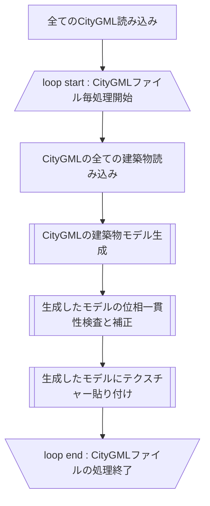
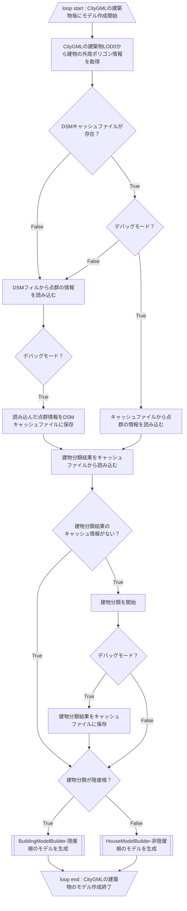

# LOD2建築物自動作成ツールの実行フロー
- [CityGMLの建築物モデル生成](#CityGMLの建築物モデル生成)
- [生成したモデルの位相一貫性検査と補正](#生成したモデルの位相一貫性検査と補正)
- [生成したモデルにテクスチャー貼り付け](#生成したモデルにテクスチャー貼り付け)



### CityGMLの建築物モデル生成
- [BuildingModelBuilder-陸屋根のモデルを生成](./flat-model/README.md)
- [HouseModelBuilder-非陸屋根のモデルを生成](./non-flat-model/README.md)



### 生成したモデルの位相一貫性検査と補正

```mermaid
```


### 生成したモデルにテクスチャー貼り付け

```mermaid
```
