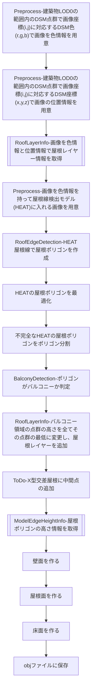

# HouseModelBuilder-非陸屋根のモデルを生成
- [RoofLayerInfo-画像を色情報と位置情報で屋根レイヤー情報を取得](./roof-layer-info/README.md)
- [ModelEdgeHeightInfo-屋根ポリゴンの高さ情報を取得](./model-edge-height-info/README.md)

```mermaid
flowchart TB
  node_1["Preprocess-建築物LOD0の範囲内のDSM点群で画像座標(i,j)に対応するDSM色(r,g,b)で画像を色情報を用意"]
  node_2["Preprocess-建築物LOD0の範囲内のDSM点群で画像座標(i,j)に対応するDSM座標(x,y,z)で画像の位置情報を用意"]
  node_3[["RoofLayerInfo-画像を色情報と位置情報で屋根レイヤー情報を取得"]]
  node_4["Preprocess-画像を色情報を持って屋根線検出モデル(HEAT)に入れる画像を用意"]
  node_5["RoofEdgeDetection-HEAT屋根線で屋根ポリゴンを作成"]
  node_6["HEATの屋根ポリゴンを最適化"]
  node_7["不完全なHEATの屋根ポリゴンをポリゴン分割"]
  node_8["BalconyDetection-ポリゴンがバルコニーか判定"]
  node_9["RoofLayerInfo-バルコニー領域の点群の高さを全てその点群の最低に変更し、屋根レイヤーを追加"]
  node_10["ToDo-X型交差屋根に中間点の追加"]
  node_11[["ModelEdgeHeightInfo-屋根ポリゴンの高さ情報を取得"]]
  node_12["壁面を作る"]
  node_13["屋根面を作る"]
  node_14["床面を作る"]
  node_15["objファイルに保存"]

  node_1 --> node_2
  node_2 --> node_3
  node_3 --> node_4
  node_4 --> node_5
  node_5 --> node_6
  node_6 --> node_7
  node_7 --> node_8
  node_8 --> node_9
  node_9 --> node_10
  node_10 --> node_11
  node_11 --> node_12
  node_12 --> node_13
  node_13 --> node_14
  node_14 --> node_15
```
