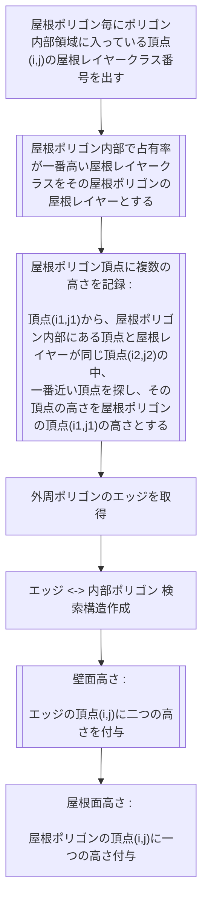
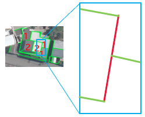
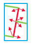
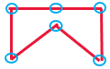

# ModelEdgeHeightInfo-屋根ポリゴンの高さ情報を取得
- [屋根ポリゴン内部で占有率が一番高い屋根レイヤークラスをその屋根ポリゴンの屋根レイヤーとする](#屋根ポリゴン内部で占有率が一番高い屋根レイヤークラスをその屋根ポリゴンの屋根レイヤーとする)
- [屋根ポリゴン頂点に複数の高さを記録](#屋根ポリゴン頂点に複数の高さを記録)
- [壁面高さ](#壁面高さ)

### 屋根ポリゴン内部で占有率が一番高い屋根レイヤークラスをその屋根ポリゴンの屋根レイヤーとする

### 屋根ポリゴン頂点に複数の高さを記録

### 壁面高さ

