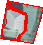
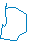
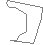
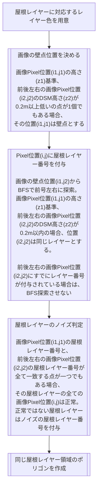

# RoofLayerInfo-画像を色情報と位置情報で屋根レイヤー情報を取得
- 画像の壁点位置を決める
  - 
- Pixel位置(i,j)に屋根レイヤー番号を付与
  - 
- 屋根レイヤーのノイズ判定
  - 
- 同じ屋根レイヤー領域のポリゴンを作成
  - 

```mermaid

flowchart TB
  node_1["屋根レイヤーに対応するレイヤー色を用意"]
  node_2[["画像の壁点位置を決める<br /><br />画像Pixel位置(i1,j1)の高さ(z1)基準、<br />前後左右の画像Pixel位置(i2,j2)のDSM高さ(z2)が<br />0.2m以上低いの点が1個でもある場合、<br />その位置(i1,j1)は壁点とする"]]
  node_3[["Pixel位置(i,j)に屋根レイヤー番号を付与<br /><br />画像の壁点位置(i1,j2)から BFSで前号左右に探索。<br />画像Pixel位置(i1,j1)の高さ(z1)基準、<br />前後左右の画像Pixel位置(i2,j2)のDSM高さ(z2)が<br />0.2m以内の場合、位置(i2,j2)は同じレイヤーとする。<br /><br />前後左右の画像Pixel位置(i2,j2)にすでにレイヤー番号が付与されている場合は、BFS探索させない"]]
  node_4[["屋根レイヤーのノイズ判定<br /><br />画像Pixel位置(i1,j1)の屋根レイヤー番号と、<br />前後左右の画像Pixel位置(i2,j2)の屋根レイヤー番号が全て一致する点が一つでもある場合、<br />その屋根レイヤーの全ての画像Pixel位置(i,j)は正常。<br />正常ではない屋根レイヤーはノイズの屋根レイヤー番号を付与"]]
  node_5[["同じ屋根レイヤー領域のポリゴンを作成"]]

  node_1 --> node_2
  node_2 --> node_3
  node_3 --> node_4
  node_4 --> node_5
```