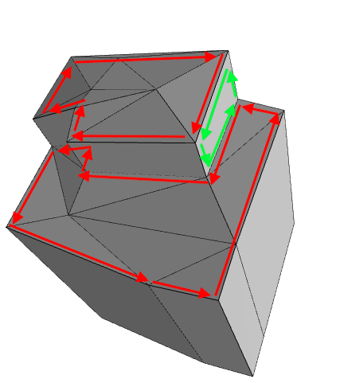
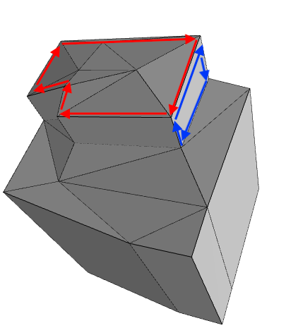
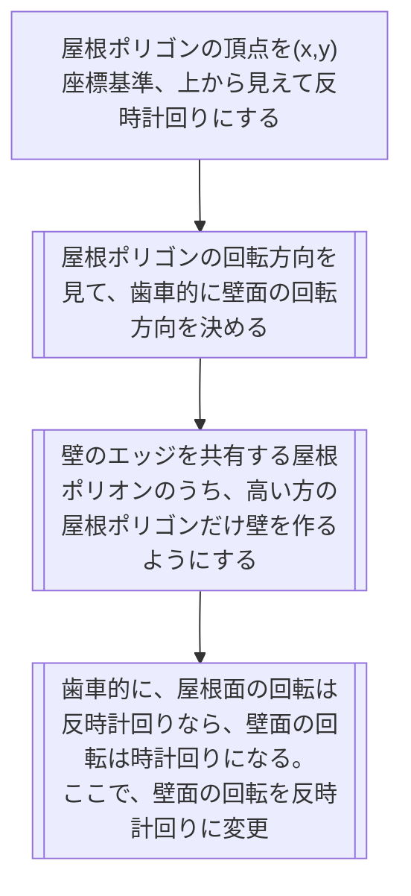

# 壁面を作る
- 屋根ポリゴンの回転方向を見て、歯車的に壁面の回転方向を決める
- 壁のエッジを共有する屋根ポリオンのうち、高い方の屋根ポリゴンだけ壁を作るようにする
  - 
- 歯車的に、屋根面の回転は反時計回りなら、壁面の回転は時計回りになる。\nここで、壁面の回転を反時計回りに変更
  - 

```mermaid
flowchart TB
  node_1["屋根ポリゴンの頂点を(x,y)座標基準、上から見えて反時計回りにする"]
  node_2[["屋根ポリゴンの回転方向を見て、歯車的に壁面の回転方向を決める"]]
  node_3[["壁のエッジを共有する屋根ポリオンのうち、高い方の屋根ポリゴンだけ壁を作るようにする"]]
  node_4[["歯車的に、屋根面の回転は反時計回りなら、壁面の回転は時計回りになる。\nここで、壁面の回転を反時計回りに変更"]]

  node_1 --> node_2
  node_2 --> node_3
  node_3 --> node_4
```
